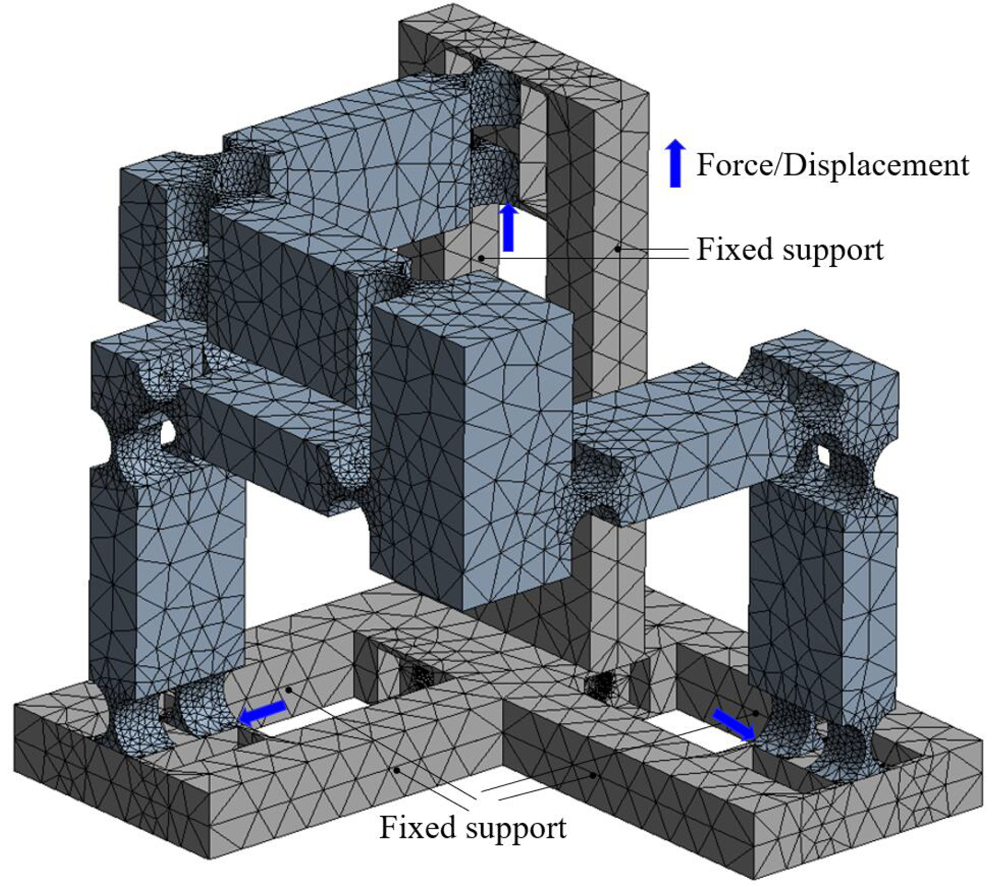
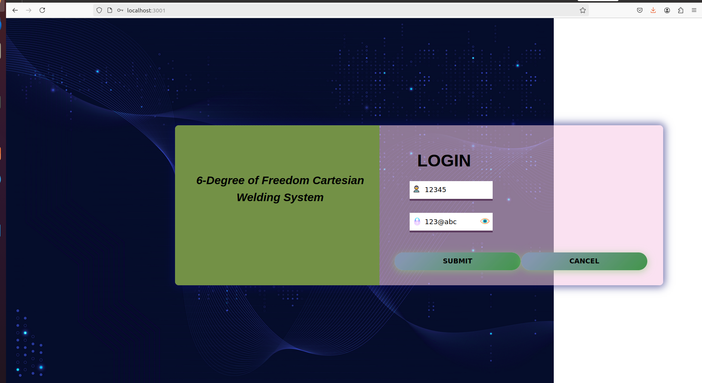
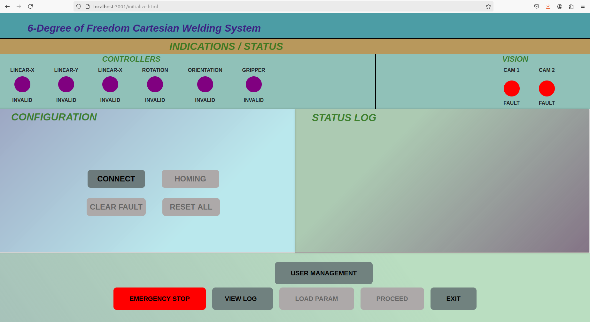
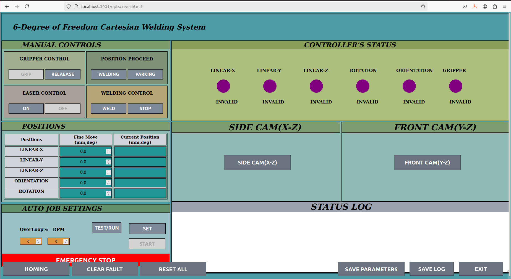

# 6-Degree-of-Freedom-Triptiron-based-Miniature-Capsules-Welding
This project presents a precision-controlled robotic system for miniature TIG welding, featuring a custom 6-DOF Tripteron manipulator integrated with industrial TIG equipment and ROS-based remote control. The system is optimized for micro-scale applications such as medical device, aerospace components, and research in automated micro-fabrication.
Miniature Capsule Welding System Using 6-DOF Tripteron and TIG Welding

⚙️ System Architecture
🔩 Capsule Details
Material: Metallic (assumed, e.g., stainless steel)
Dimensions: 6 mm (diameter) × 10 mm (length)
Welding Requirement: Circumferential weld to join split halves into a single sealed capsule.

🛠 Welding Setup
Welding Machine: Schneider TIG (Gas Tungsten Arc Welding)
Torch Mounting: Tungsten torch is fixed vertically, suspended from the top structure close to Tripteron EET.
Precision Requirements: High precision in positioning and rotational control for uniform weld quality.

🤖 Robotic Manipulator: 6-DOF Tripteron-Based System
🧭 Translational Motion: 3-DOF Tripteron
A Tripteron mechanism was custom-designed to provide precise linear motion in the X, Y, and Z axes.Each axis is powered by Maxon motors with EPOS controllers to ensure micro-scale accuracy.Limit switches were installed at both ends of all three axes to ensure mechanical safety and repeatability.

🧠 End-Effector Tool (Gripper): 3-DOF Orientation
The gripper mounted on the Tripteron's end-effector provides the following rotational degrees of freedom:
Orientation Rotation: 360° continuous EET(gripper) rotation 90 degree CW and CCW (just like human wrist up and down movement 90 degree).
Gripper Finger Actuation: Opening and closing mechanism for capsule gripping.
Gripper Finger Roation: To rotate the fingers holding capsule continously. This rotation has no physical limit.

All gripper motions are actuated using Maxon motors with EPOS controllers.
Current threshold-based feedback is used to define motion limits for:
Finger opening/closing
Gripper orientation

All physical limit switches were taken as a digital input and the welding ON and OFF control was taken as a digital output of Master EPOS controller.

🧪 Welding Process Flow
The split capsule is placed in the gripper manually or via pre-feeding.The Tripteron positions the capsule precisely beneath the tungsten torch. The gripper rotates the capsule 360° while TIG welding is performed to create a seamless joint.
3-second pre-flow and post-flow shielding gas delay is configured in the TIG welding process for optimal weld protection. Cameras capture the weld process in real time and also assist in quality inspection post-welding.

👁️ Visual Feedback System
Two high-resolution industrial cameras are mounted on the Tripteron:
Front View Camera: Provides a direct line of sight for torch-to-capsule alignment.
Side View Camera: Offers perpendicular visibility for process monitoring and post-weld quality inspection.

🖥️ Software Framework
🤖 ROS-Based Control
The entire system is powered by the Robot Operating System (ROS) noetic middleware. A set of custom ROS messages is developed for:
Current position tracking of each motor
Current draw feedback for axis without any physical limit switch
Controller status and fault monitoring

🌐 Web Interface
A ROSBridge server is implemented to expose the ROS topics and services to the web. A custom web interface allows for:
Remote visualization of the welding process
Teleoperation control of the Tripteron and gripper
Real-time feedback display (motor status, position, current)

✅ Key Features
High-precision micro-welding for small-scale components, 6-DOF control (3 translational, 3 rotational) for complete capsule manipulation, TIG welding integration with accurate rotational control. ROS-based modular architecture with web-enabled remote operation, Dual-camera system for real-time process monitoring and post-process inspection.Full automation with supervisory human oversight.

🧪 Testing Without Hardware
<pre> <code> git clone https://github.com/I-R2025/Autonomous-Disinfection-Robot.git</code> </pre>

The control system can not be tested with hardware. i.e.
<pre> <code> source ases_mc_pkg1/devel/setup.bash</code> </pre>
<pre> <code> roslaunch ases_mc_pkg1 nodes.launch </code> </pre>

First install nodemon and npm in your distribution and then inside UI folder enter this command.
<pre> <code>node app.js</code> </pre>

Following screen can be seen

Login Screen

First Screen

Control Screen

